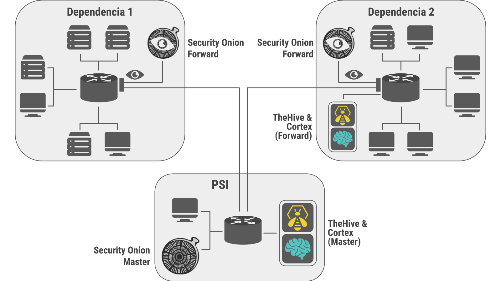

# csirt-docs

Documentación general del CSIRT UNC

## Tabla de Contenidos
  * [El CSIRT UNC](#el-csirt-unc)
    * [La misión del CSIRT UNC](#la-misión-del-csirt-unc)
    * [Partes del CSIRT](#partes-del-csirt)
    * [Arquitectura del CSIRT](#arquitectura-del-csirt)
    * [Security Onion](#security-onion)
  * [NSM](#nsm)  
      * [Nodo Forward (Security Onion)](#nodo-forward-security-onion)
      * [Deteccion de intrusiones utilizando Machine Learning](#deteccion-de-intrusiones-utilizando-machine-learning)
  * [SIEM](#siem)
    * [Servidor Master (Security Onion)](#servidor-master-security-onion)
    * [Gestor de incidentes](#gestor-de-incidentes)
  * [Consideraciones a futuro](#consideraciones-a-futuro)
    * [Autenticación en Elastic](#autenticación-en-elastic)
    * [Realimentación modelo Machine Learning](#realimentación-modelo-machine-learning)

## El CSIRT UNC

Cuando ocurre un incidente de seguridad, una organización necesita una forma de responder. Un Equipo de respuesta a incidentes de seguridad informática (CSIRT) es un grupo interno que se encuentra comúnmente dentro de una organización que proporciona servicios y funciones para proteger los activos de esa organización.

Un CSIRT no solo responde necesariamente a incidentes que ya han sucedido. Un CSIRT también puede proporcionar servicios y funciones proactivos, como pruebas de penetración, detección de intrusiones o incluso capacitación en conciencia de seguridad. Estos tipos de servicios pueden ayudar a prevenir incidentes, pero también aumentan el tiempo de respuesta y mitigan los daños. En el caso de que un incidente de seguridad deba ser contenido y mitigado, el CSIRT coordina y supervisa estos esfuerzos.

### La misión del CSIRT UNC

+ Proporcionar un servicio de respuesta sistemática a los incidentes de ciberseguridad apoyando a las dependencias de la UNC a través del uso de la mejor tecnología disponible.
+ Sensibilizar en seguridad de las tecnologías de información y comunicación.
+ Incrementar el nivel de conocimiento acerca de la seguridad de la información.
+ Coordinar los esfuerzos para promover las mejores prácticas de la seguridad y crear confianza entre la comunidad del ciberespacio dentro de la UNC.
+ Ayudar a manejar ataques e incidentes de la seguridad de la información.
+ Generar recursos humanos en el campo de la seguridad de la información.
+ Proporcionar un ambiente de confianza para las e-transacciones.
+ Fomentar la confianza, cooperación y colaboración dentro de la UNC.
+ Intercambiar conocimiento con otros centros de respuesta a incidentes.

### Partes del CSIRT

El CSIRT esta compuesto por dos partes: NSM y SIEM

1. NSM (Monitoreo de seguridad de red) - Proporciona contexto, inteligencia y conciencia situacional de la red.
2. SIEM (Gestión de información y eventos de seguridad) - Se encaraga de almacenar la informacion recolectada para poder consultarla a futuro.

### Arquitectura del CSIRT

La arquitectura del CSIRT esta formado por varias computadoras y servicios interconectados.

Hay una o varias maquinas llamadas **nodo forward**, en cada uno se tiene un IDS que hace la detección de un posible incidente. El tráfico de red es capturado y procesado por distintas herramientas, generando alertas de intrusión o de comportamientos notables/inusuales. Los datos procesados pueden ser datos de contenido completo, datos de alertas, datos de activos, datos de host, datos de transacción y/o datos de sesión.

En una maquina llamada **servidor master** se realiza la gestión y análisis de alertas. Alertas previamente generadas (de un nodo forward por ejemplo) son recibidas, normalizadas y almacenadas. Se pueden realizar análisis directos o se pueden enviar alertas hacia otras aplicaciones bajo ciertas condiciones.

La maquina servidor master, asi como tambien algunos de los nodos forward, son basados en el suite de herramientas **Security Onion**. El resto de los nodos forward son simples maquinas virtuales corriendo un IDS propio construido con tecnicas de Machine Learning.

En una maquina se tiene **TheHive y Cortex** que facilita la gestión de incidentes y la automatización de respuestas ante los mismos. Alertas son filtradas en el servidor master y enviadas a TheHive usando ElastAlert. 

### Security Onion

Security Onion es un suite de herramientas gratuita y de código abierto desarrollado para detección de intrusos, monitoreo de seguridad empresarial y gestión de logs. Se distribuye en forma de una distribución de Linux o como grupos de paquetes de software descargables.

Entrelaza sin problemas tres funciones principales:
+ captura completa de paquetes;
+ sistemas de detección de intrusos basados en red y en host (NIDS y HIDS, respectivamente);
+ y potentes herramientas de análisis.

Se basa en un modelo distribuido cliente-servidor modificado. Una implementación distribuida estándar está compuesta por el servidor maestro (Servidor Master), uno o más nodos de reenvío (Nodos Forward) y uno o más nodos de almacenamiento (Nodos Storage). Esta arquitectura es ideal; Si bien puede costar más por adelantado, esta arquitectura proporciona una mayor escalabilidad y rendimiento en el futuro, ya que uno simplemente puede "conectar" nuevos nodos de almacenamiento para manejar más tráfico o fuentes de logs.

## NSM

### Nodo Forward (Security Onion)

- [Guía de Requerimientos de Hardware](security-onion/forward/forward-hardware-guide.md#guía-de-requerimientos-de-hardware-de-un-nodo-forward)
- [Guía de Instalación](security-onion/security-onion-install-guide.md#guía-de-instalación-de-security-onion)
- [Guía de Administración](security-onion/security-onion-administration-guide.md#guía-de-administración-de-security-onion)
- [Guía de Configuración (TO-DO)](admin/configuration.md)
- [Guía de modificacion de prioridades IDS](security-onion/forward/forward-modificacion-prioridad-guide.md#guía-de-modificacion-de-prioridades )

Cuando se usa un Nodo Forward, los componentes de Elastic Stack no están instalados. Syslog-NG reenvía todos los registros a Logstash en el servidor maestro a través de un túnel autossh, donde se almacenan en Elasticsearch en el servidor maestro, o se reenvían a la instancia Elasticsearch del nodo de almacenamiento (si el servidor maestro se ha configurado para usar un nodo de almacenamiento). A partir de ahí, los datos pueden consultarse mediante el uso de la búsqueda búsqueda cruzada entre clústeres.

Los Nodos Forward ejecutan los siguientes componentes (modo de producción con mejores prácticas):

+ Bro (NIDS)
+ Suricata (NIDS)
+ Netsniff-NG (captura de paquetes de red)
+ OSSEC (HIDS)
+ Syslog-NG (envió de logs)

#### Requisitos de Hardware

Ver "Guía de Requerimientos de Hardware" abajo..

Hardware necesario dependiendo de la cantidad de trafico

Cuanto almacenamiento es necesario para cuanto tiempo de retención.

##### Trafico sostenido promedio <200Mbps
+ Núcleos CPU:
+ RAM:

##### Trafico sostenido promedio >200Mbps & <500(?)Mbps
+ Núcleos CPU:
+ RAM:

Link a documento especificando las pruebas realizadas (?)

### Deteccion de intrusiones utilizando Machine Learning

- [Guia de uso](https://gitlab.unc.edu.ar/csirt/ml_implementation)

De forma paralela, se desarrollo un Sistema de Deteccion de Intrusiones (IDS) utilizando un algoritmo de Arbol de Decision, el cual fue entrenado con datos propios
de las dependencias de la Universidad. El sistema clasifica los flujos de conexiones en alguno de los siguientes tipos:

+ Trafico Benigno
+ Escaneo de puertos
+ Ataque de denegacion de servicio
+ Ataque de inyeccion SQL
+ Acceso a SSH por fuerza bruta

El mismo sistema se encarga de generar alertas, las cuales se almacenan en un log llamado **alert.log**. Los datos de las alertas son enviados al servidor master
de Security Onion.

## SIEM

### Servidor Master (Security Onion)

- [Guía de Instalación](security-onion/security-onion-install-guide.md#guía-de-instalación-de-security-onion)
- [Guía de Administración](security-onion/security-onion-administration-guide.md#guía-de-administración-de-security-onion)
- [Guía de Configuración de Logstash](security-onion/master/logstash/master-logstash-guide.md#guía-de-configuracion-de-logstash)
- [Reglas de elastalert](security-onion/master/elastalert/security-onion-elastalert-rules.md#reglas-de-elastalert)

El servidor maestro ejecuta su propia copia local de Elasticsearch, que administra la configuración de búsqueda entre clústeres para la implementación. Esto incluye la configuración para Nodos Storage, pero no para Nodos Forward, ya que no ejecutan componentes de Elastic Stack. Un analista se puede conectar al servidor desde una estación de trabajo cliente para ejecutar consultas y recuperar datos.

El servidor maestro ejecuta los siguientes componentes (modo de producción con mejores prácticas):

+ Elasticsearch
+ Logstash
+ Kibana
+ Curador
+ Elastalert
+ Redis (solo si está configurado para enviar a un nodo de almacenamiento)
+ OSSEC
+ Sguild

#### Requisitos de Hardware

Un servidor maestro empresarial debe tener 8 núcleos de CPU como mínimo, 16-128 GB de RAM y suficiente espacio en disco (se recomiendan varios terabytes) para cumplir con sus requisitos de retención de logs. Los requerimientos pueden variar dependiendo de la cantidad de logs nuevos que son recibidos y de la cantidad de consultas que se realizan a los logs ya almacenados.

Cuanto almacenamiento es necesario para cuanto tiempo de retención.

+ Núcleos CPU:
+ RAM:

### Gestor de incidentes

- [Guía de Instalación mamual](gestion-de-incidentes/incidentes-install-guide.md#guía-de-instalación-de-gestor-de-incidentes)
- [Guía de Instalación con Ansible](https://gitlab.unc.edu.ar/csirt/thehive-cortex-ansible/tree/master#the-hive-y-cortex-con-instalacion-automatica-en-ansible)
- [Guía de Configuración](admin/configuration.md)
- [Guía de Administración](gestion-de-incidentes/guia-administracion.md)
- [Webhooks](https://gitlab.unc.edu.ar/csirt/thehive-cortex-webhooks/tree/master#instalacion-webhooks-para-thehive-y-respuesta-automatica-a-alertas)
- [Responders](https://gitlab.unc.edu.ar/csirt/thehive-cortex-responders/tree/master#responders-para-cortex-analyzer)
- [Como crear un responder](gestion-de-incidentes/responders-doc/como-crear-un-responder.md#cómo-escribir-un-responder)
- [Como ejecutar un responder](gestion-de-incidentes/responders-doc/ejecutar-responder.md#como-ejecutar-un-responder)

Utilizar un gestor de respuestas a incidentes, viene de la necesidad de tener un seguimiento, tanto de los potenciales ataques, como de los que se han llevado a cabo. También es necesario correlacionar eventos, ya que los ataques en general se realizan en varias etapas diferentes. Incorporar estas características mencionadas permite tener un mejor panorama de las amenazas.

#### Requisitos de Hardware

VER-> Hardware necesario dependiendo de la cantidad de trafico 
VER-> Cuanto almacenamiento es necesario para cuanto tiempo de retención.

Los requerimientos de hardware son

+ Núcleos CPU: 8vCPU
+ RAM: 8 GB
+ Disco: 60 GB

#### TheHive
TheHive es una plataforma de respuesta a incidentes de seguridad gratuita y de código abierto escalable. En esta herramienta, cada investigación corresponde a un caso. En el mensaje que recibe desde Elastalert vienen los Observables, que son campos de la alerta considerados de interés para analizar.

#### Cortex
Es una herramienta que sirve para analizar los Observables enviados a TheHive. Se pueden ejecutar operaciones mediante Responders que utilizan los Observables como variables de entrada. El analista puede ejecutar los Responders para que realicen algún tipo de acción automatizada.

## Consideraciones a futuro 
En esta seccion se trata los trabajos o consideraciones que se deberian tener en cuenta a futuro en el proyecto. Tambien se cuenta algunas experiencias que tuvo el equipo. 

### Autenticación en Elastic

#### Elastic auth

A partir de Elastic 6.8.0, la autenticación Elastic se incluye de forma gratuita en Elastic Features. Esto le permite asignar diferentes privilegios a diferentes usuarios en Kibana.

##### Guía de activación

Para habilitar, simplemente ejecutar `so-elastic-auth` en un servidor master y seguir las instrucciones. `so-elastic-auth` hará lo siguiente:

* guiarlo a través del cambio de Elastic Features si es necesario
* habilita la autenticación en Elasticsearch, Logstash, Kibana, Curator y ElastAlert
* encuentra cualquier cuenta de usuario existente en la base de datos Sguil y cree las cuentas correspondientes en Elasticsearch con privilegio de solo lectura de forma predeterminada

Una vez que haya completado `so-elastic-auth`, debe:

* inicie sesión en Kibana con la `elastic` cuenta de superusuario
* establecer cualquier otro privilegio de cuenta según sea necesario
* distribuya las contraseñas temporales generadas por `so-elastic-auth` sus usuarios y haga que restablezcan sus contraseñas.

Tenga en cuenta que continuará autenticándose en Sguil, Squert y CapMe con su cuenta tradicional Sguil/Squert/CapMe.

link referencia:

* https://securityonion.readthedocs.io/en/latest/elastic-auth.html

##### Experiencia

Esta opción se probo en servidor master. No se encontró la manera de limitar el acceso de usuarios a algunos indicies de Elasticsearch. Cualquier usuario con privilegios para ver indices, puede buscar agregar un nuevo patrón de indice y de esta manera agregar indices que se supone que no debería tener acceso.

#### Seguridad a nivel de campo y documento

"Puede controlar el acceso a los datos dentro de un índice agregando permisos de seguridad a nivel de campo y documento a un rol. Los permisos de seguridad a nivel de campo restringen el acceso a campos particulares dentro de un documento. Los permisos de seguridad a nivel de documento restringen el acceso a documentos particulares dentro de un índice."

Esto puede ser utilizado para permitir visibilidad a alertas de una única dependencia por ejemplo. Se observo que esto requiere una licencia de Elastic con X-Pack.

[Documentación Oficial](https://www.elastic.co/guide/en/x-pack/current/field-and-document-access-control.html#field-and-document-access-control)

### Realimentación modelo Machine Learning

En un modelo de aprendizaje automático, es muy importante mejorar el modelo analítico periódicamente para que el mismo esté actualizado con el trafico de la red.
En este momento, nuestro IDS esta entrenado estaticamente con un conjunto de datos del periodo 09/2019 - 10/2019. 
Como trabajo futuro, se propone agregar un sistema de realimentacion continua al modelo. Esta tarea se puede realizar de dos maneras:

+ Modo por lotes manual: Se reentrena el modelo cada un cierto periodo fijo (p.e. una vez por semana).

+ Modo en linea: El modelo se actualiza por cada evento entrante.

Para mas información acerca de como reentrenar un modelo de machine learning por lotes, visite.

- [Reentrenamiento con Kubernetes Cronjobs](https://mlinproduction.com/k8s-cronjobs/)

