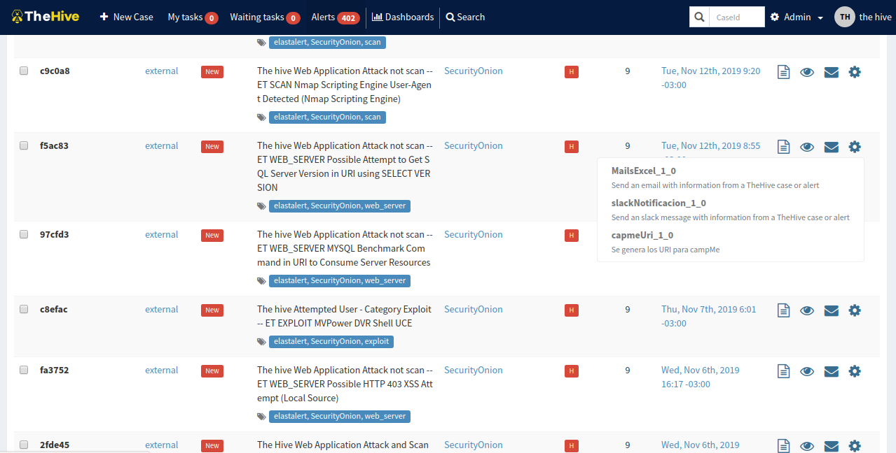

# Como ejecutar un responder

[Volver a documento raiz](https://gitlab.unc.edu.ar/csirt/csirt-docs/tree/master#csirt-docs)

[Documentacion de responders](https://gitlab.unc.edu.ar/csirt/thehive-cortex-responders/blob/master/README.md)

## Ejecucion desde una alerta

Los usuarios de TheHive pueden ejecutar un responder desde cualquier alerta. Dentro de la pestaña **Alerts**, nos situamos sobre una de ellas. A la derecha de la
alerta veremos varias opciones, si hacemos click en la ultima, se desplegara un menu con los distintos responders disponibles para ejecutar. Simplemente debemos
seleccionar el que queremos ejecutar. Se abre un cartel de confirmacion, le damos a "Yes, run it!" y listo.

Para ver si el responder fue ejecutado exitosamente, debemos dirigirnos a Cortex (puerto 9001). En la pantalla principal de "Jobs History" se muestra una lista
con los ultimos responders ejecutados y su estado. 

Se puede ver un reporte de la ejecucion haciendo click en la opcion **View**

Esto ultimo es especialmente util en caso de que se quiera investigar la razon por la que un responder falla.

### Tener en cuenta

Una de las principales razones por las que puede fallar un responder es por no tener las entradas necesarias para ser ejecutado. En la [Documentacion de responders](https://gitlab.unc.edu.ar/csirt/thehive-cortex-responders/blob/master/README.md)
se puede encontrar los parametros necesarios para ejecutar cada uno. Para saber si la alerta cumple con los requisitos, podemos seleccionar la opcion **Preview and Import**
para ver todos los observables de la alerta

## Ejecucion desde un caso

La ejecucion desde un caso es practicamente la misma que para una alerta. Dentro de la pestaña **List of Cases** seleccionamos el caso desde el cual queremos
lanzar el responder, luego vamos a la pestaña **Responders** y seleccionamos el que queremos ejecutar. Los reportes de la ejecucion pueden verse en Cortex al
igual que con las alertas.

