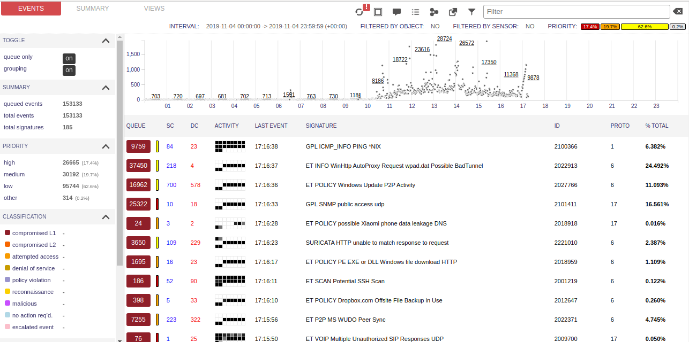
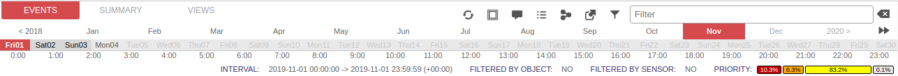
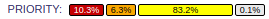
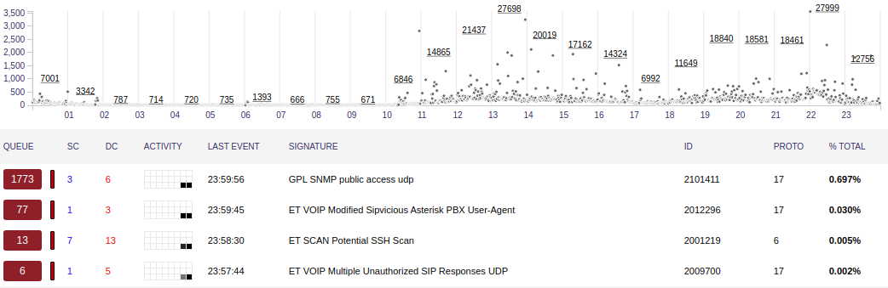
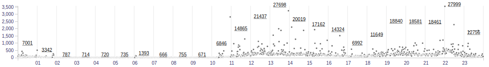
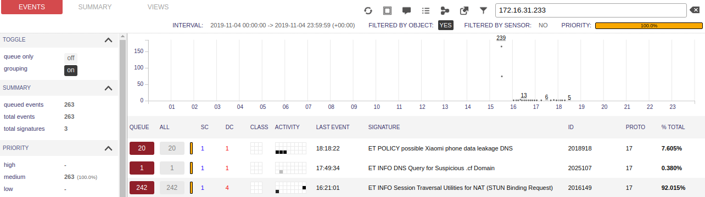
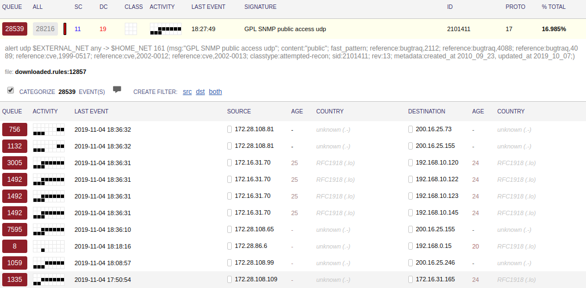

# Squert

Squert es una aplicación web que se utiliza para consultar y ver datos de eventos almacenados en una base de datos Sguil (generalmente datos de alerta IDS). 
En la siguiente guia se documentan sus distintas opciones para visibilizar y filtrar estos datos.

[Volver a documento raíz](https://gitlab.unc.edu.ar/csirt/csirt-docs/tree/master#csirt-docs)

## Captura de pantalla

## Autenticación

Squert solicitara un usuario y contraseña para acceder. Estos son los mismos que se determinaron al momento de la configuracion del Sistema Operativo.

## Cambiar intervalo de tiempo

En squert se puede seleccionar el intervalo de tiempo del cual mostrar las alertas. Por defecto, se muestran las alertas a partir de las 00:00 hs del dia actual.
Para modificar este tiempo, hacer click en INTERVAL y modificar fecha y hora de inicio y fin del intervalo. Para guardar los cambios, presionar actualizar (dos flechas circulares arriba)

## Seleccionar alertas por prioridad

Las alertas en squert tienen niveles de prioridad, los cuales se identifican con colores:

*  Rojo: Alertas de prioridad 1, es decir, las mas criticas.
*  Naranja: Alertas de prioridad 2, intermedias.
*  Amarillo: Alertas de prioridad 3, baja.
*  Gris: Alertas de OSSEC (HIDS).

Se puede filtrar las alertas por prioridad en la opcion PRIORITY arriba a la derecha.

Por ejemplo, seleccionando las alertas de prioridad 1

## Diagrama de tiempo

El diagrama de tiempo en la parte superior representa los eventos a medida que ocurren cada día.
En resumen, el diagrama de tiempo:

*  Traza el número bruto de eventos por minuto.
*  Usa el eje X como la hora del día y el eje Y es el número de minutos de eventos.
*  Trata cada región equivalente a una hora.
*  Traza y subraya el número de eventos en cada región para esa hora.

## Filtros

Squert cuenta con una herramientas de filtrado, con la cual se puede seleccionar las alertas por IP, categoria de evento, nombre de la alerta, etc. El panel se encuentra en la parte de arriba de la pantalla principal, a la derecha.

## Alertas

El panel de alertas consta de varias columnas, que se explican a continuación:

*  **QUEUE** - Número de eventos agrupados en la cola.
*  **SC** - Número de IPs de origen distintas para la alerta.
*  **DC** - Número de IPs de destino distintas para la alerta.
*  **ACTIVITY** - Número de eventos para la alerta dada por hora.
*  **LAST EVENT** -  Última vez que ocurrió el evento.
*  **SIGNATURE** - Firma de IDS del evento.
*  **ID** - ID de firma del evento.
*  **PROTO** - Protocolo relativo/reconocido dentro/con respecto al evento.
*  **% TOTAL** - Porcentaje de agrupación de eventos versus recuento de eventos completo.

### Seleccionando una alerta

Para ver mas detalles de una alerta, simplemente hacer click en ella desplega en menu con mucha mas informacion sobre la misma.

Ahora la alerta se agrupa por cantidad de eventos desde la misma Ip de origen a la misma IP de destino

